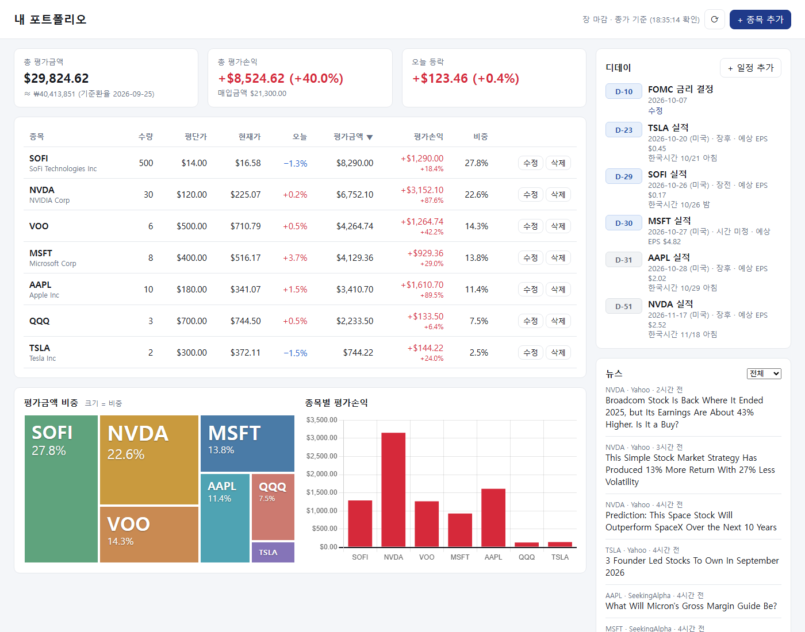

# 내 주식 대시보드

내 PC에서만 여는 미국 주식 포트폴리오 대시보드입니다. 실시간 시세로 평가손익과 비중을 보여주고, 실적발표일·직접 넣은 일정을 디데이로, 보유 종목 뉴스를 목록으로 보여줍니다.



<sub>예시 포트폴리오로 찍은 화면입니다. 시세·실적 일정·뉴스는 촬영 시점(2026-09-27)의 실제 데이터입니다.</sub>

## 준비

1. Node.js 24 이상
2. [finnhub.io](https://finnhub.io)에서 무료 가입 후 API 키 발급

## 설치와 실행

```bash
npm install
cp .env.example .env   # .env를 열어 FINNHUB_API_KEY에 키를 넣는다
npm start
```

브라우저에서 콘솔에 나온 주소(기본 `http://127.0.0.1:5173`)를 엽니다.

## 데이터와 보안

- 보유 종목과 일정은 `data/portfolio.json`에 저장됩니다. 이 파일을 복사해 두면 백업이 됩니다.
- 서버는 `127.0.0.1`에서만 열려서 같은 네트워크의 다른 기기에서는 접속할 수 없습니다.
- 외부(Finnhub)로 나가는 정보는 조회하는 티커뿐입니다. 수량·평단가는 PC 밖으로 나가지 않습니다.
- `.env`와 `data/`는 git에 올라가지 않습니다.

## 갱신 주기

- 시세: 미국 장중 30초마다 (장외에는 자동 갱신 멈춤, [⟳]로 수동 갱신)
- 뉴스·실적 일정·환율: 30분마다
- 원화 환산은 하루 1번 고시되는 기준환율(Frankfurter)을 씁니다.

## 테스트

```bash
npm test
```
