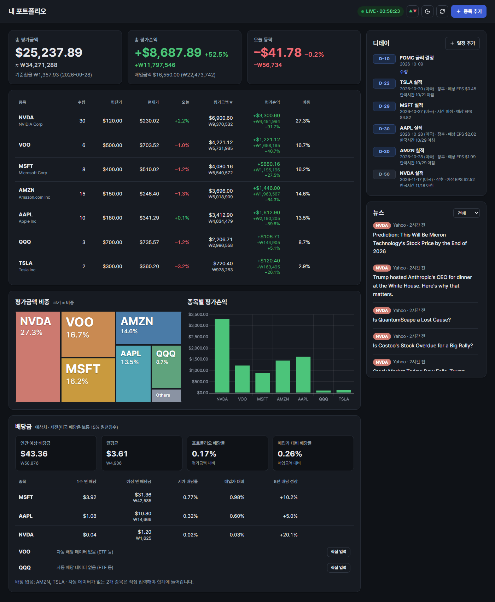

# 내 주식 대시보드

내 PC에서만 여는 미국 주식 포트폴리오 대시보드입니다. 실시간 시세로 평가손익과 비중을 보여주고, 예상 배당금을 계산하며, 실적발표일·직접 넣은 일정을 디데이로, 보유 종목 뉴스를 목록으로 보여줍니다.


<sub>예시 포트폴리오로 찍은 화면입니다. 시세·배당·실적 일정·뉴스는 촬영 시점(미국 2026-10-02 프리마켓)의 실제 데이터이며, '오늘' 등락은 프리마켓 가격 기준입니다.</sub>



<sub>다크 모드 + 미국식 등락 색(상승 초록·하락 빨강). 같은 시점에 촬영.</sub>

## 새 머신에 설치하기

### 1. 준비

- [Node.js](https://nodejs.org) 24 이상 (`node -v`로 확인)
- [Git](https://git-scm.com)
- [finnhub.io](https://finnhub.io)에서 무료 가입 후 받은 API 키 (쓰던 키를 그대로 써도 됩니다)

### 2. 코드 받기와 설치

```bash
git clone https://github.com/0421cjy/stock-dashboard.git
cd stock-dashboard
npm install
```

### 3. API 키 넣기

`.env.example`을 `.env`로 복사한 뒤, `.env`를 열어 `FINNHUB_API_KEY=` 뒤에 키를 붙여 넣습니다.

```bash
cp .env.example .env
```

Windows PowerShell에서는 `Copy-Item .env.example .env`를 씁니다. 5173 포트를 이미 다른 프로그램이 쓰고 있다면 `.env`의 `PORT`를 다른 번호로 바꿉니다.

### 4. 보유 종목 옮기기 (선택)

보유 종목과 일정은 git에 올라가지 않습니다. 쓰던 PC의 `data/portfolio.json`을 새 머신의 같은 위치(`data/` 폴더를 만들고 그 안)에 복사하면 그대로 이어집니다. 복사하지 않으면 빈 대시보드로 시작하고, 화면에서 종목을 추가하면 됩니다.

총 평가금액 추이의 실제 기록을 이어가려면 `data/history.json`도 함께 복사합니다. `data/`의 다른 파일(`names.json`, `cache.json`)은 옮기지 않아도 됩니다. 새 머신에서 알아서 만들어집니다.

### 5. 실행

```bash
npm start
```

브라우저에서 콘솔에 나온 주소(기본 `http://127.0.0.1:5173`)를 엽니다.

### 처음 한 번은 조금 느릴 수 있습니다

서버는 켜질 때 환율·시세·뉴스·실적·배당을 미리 받아두고, 회사명과 뉴스·실적·배당은 `data/`에 저장해 다음부터 다시 받지 않습니다. 새 머신에서는 이 저장 파일이 없으므로:

- 서버를 켜자마자 접속하면 첫 화면이 1~3초 늦을 수 있습니다. 켜고 몇 초 뒤에 접속하면 바로 뜹니다.
- 그 브라우저로 처음 접속할 때는 원화 금액이 임시 환율(₩1,350, "임시값" 표시)로 잠깐 나왔다가 실제 환율로 바뀝니다.
- 두 번째 실행부터는 쓰던 PC와 똑같이 빠릅니다.

### 코드 업데이트

```bash
git pull
npm install
```

그다음 서버를 껐다 다시 켭니다(터미널에서 `Ctrl+C` 후 `npm start`).

## 화면 설정

오른쪽 위 버튼으로 바꿉니다. 고른 값은 브라우저에 저장되어 다음에 열어도 유지됩니다.

- **테마** (모니터·해·달 아이콘): 자동(윈도우 설정) → 라이트 → 다크 순서로 바뀝니다. 기본은 자동입니다.
- **등락 색** (▲▼ 아이콘): 한국식(상승 빨강·하락 파랑) ↔ 미국식(상승 초록·하락 빨강). 기본은 한국식입니다. D-DAY 배지·삭제 버튼처럼 경고를 뜻하는 빨강은 방식과 상관없이 그대로입니다.

## 총 평가금액 추이

요약 카드 아래 그래프입니다. 기간(1일·1주·1개월·3개월·1년)과 통화($·₩)를 고를 수 있고, 고른 값은 브라우저에 저장됩니다.

- **1일**: 15분 간격, 정규장 전체(뉴욕 09:30~16:00)를 축으로 잡고 장중에는 지금 평가금액까지 이어 그립니다. 등락은 전일 종가 기준입니다.
- **1주**: 1시간 간격. **1개월·3개월**: 일별 종가. **1년**: 주별 종가.
- **실제 기록**: 서버가 날짜별 보유 종목을 `data/history.json`에 남깁니다(켜 있는 동안 10분마다, 종목을 바꿀 때마다). 그래프는 그날 보유 수량 × 그 시점 가격으로 그립니다. 서버가 꺼져 있던 날은 직전 기록일의 보유 수량을 씁니다.
- **추정(점선)**: 기록을 시작하기 전 구간은 지금 보유 수량을 그대로 갖고 있었다고 가정해 계산합니다. 기간 중 상장한 종목은 상장 전을 0으로 계산합니다.
- **원화**: 날짜별 기준환율(Frankfurter)로 환산하고, 오늘은 지금 환율을 씁니다.
- 과거 가격은 Yahoo Finance에서 받습니다.

## 데이터와 보안

- 보유 종목과 일정은 `data/portfolio.json`에 저장됩니다. 이 파일을 복사해 두면 백업이 됩니다.
- 총 평가금액 추이용 날짜별 보유 기록은 `data/history.json`에 저장됩니다.
- `data/names.json`(회사명)과 `data/cache.json`(뉴스·실적·배당)은 빠른 로딩용 저장 파일입니다. 지워도 다시 받아 만들어집니다.
- 서버는 `127.0.0.1`에서만 열려서 같은 네트워크의 다른 기기에서는 접속할 수 없습니다.
- 외부(Finnhub, 프리마켓·애프터마켓 시간에는 Yahoo Finance)로 나가는 정보는 조회하는 티커뿐입니다. 수량·평단가는 PC 밖으로 나가지 않습니다.
- `.env`와 `data/`는 git에 올라가지 않습니다.

## 갱신 주기

- 시세: 미국 장중에는 실시간 체결가(Finnhub WebSocket)를 1초마다 반영하고, 30초마다 시세 조회로 한 번 더 맞춥니다. Finnhub 무료 실시간 데이터에 체결이 거의 오지 않는 종목(SOFI 등)은 10초 넘게 체결이 없으면 Yahoo Finance 정규장 가격으로 5초마다 채웁니다. 거래 자체가 드문 종목은 체결이 있을 때만 바뀝니다. 장외에는 자동 갱신을 멈추고 [⟳]로 수동 갱신합니다.
  - Finnhub 무료 키는 실시간 연결을 하나만 허용할 수 있어, 같은 키로 서버를 두 대 동시에 켜면 한쪽의 실시간 갱신이 멈출 수 있습니다(30초 조회는 계속 동작).
- 프리마켓(뉴욕 04:00~09:30)·애프터마켓(16:00~20:00) 가격: 1분마다. 이 시간에는 보유 종목 표의 '오늘' 등락률(앞에 `프리`/`애프터` 표시)과 요약 카드의 '오늘 등락'을 시간외 가격으로 계산합니다(프리는 마지막 정규장 종가 대비, 애프터는 전일 종가 대비). Finnhub 무료 플랜에는 시간외 가격이 없어 Yahoo Finance에서 받으며, 받지 못한 종목은 정규장 등락률로 표시합니다. 평가금액·손익은 정규장 가격 기준입니다.
- 뉴스·실적 일정·배당·환율: 30분마다
- 원화 환산은 하루 1번 고시되는 기준환율(Frankfurter)을 씁니다.

## 테스트

```bash
npm test
```
